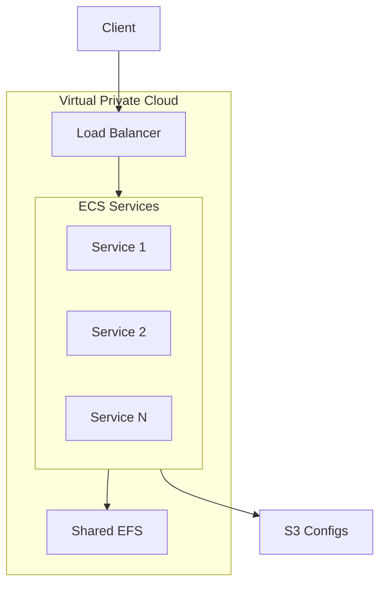
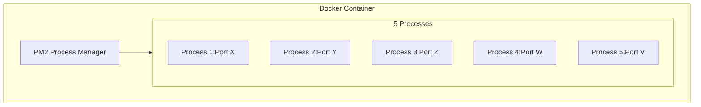

# System Architecture

## Overview Diagram

## Service Architecture

### Container Structure

## Network Architecture

### Traffic Flow
- External requests through Load Balancer
- Subdomain-based routing
- Internal service communication

### Port Management
- Each service exposes multiple ports
- Port mapping through Load Balancer
- Internal service discovery

## Storage Architecture

### Shared Storage
- EFS mount points
- Access patterns
- Performance considerations

### Configuration Storage
- S3 bucket organization
- PM2 configuration files
- Environment variables 