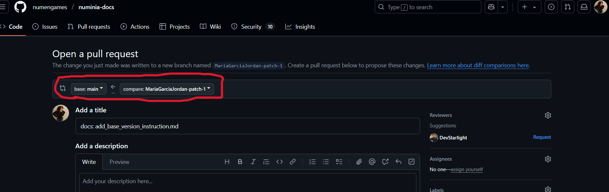
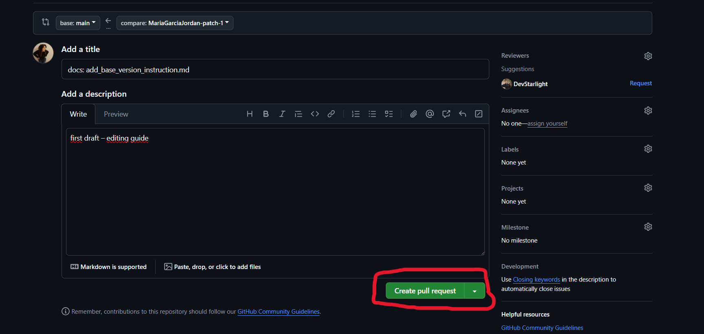

# Reference Components Library

This folder collects **external visual references** of gameplay components, interactions, and UI patterns from existing games and applications. These are **not internal components**. They are curated **inspirational examples** intended to inform the design and development of our own future systems.

## Purpose

- To document and organize references from other environments (games, platforms, tools, etc.)
- To highlight relevant visual or mechanical behaviors
- To use them as design foundations or benchmarks for future components
- To centralize material that can be discussed in workshops, design reviews, or implementation planning

## Content Guidelines

Each reference entry includes:
- A video or GIF clip (typically 10–60 seconds)
- Game or source information
- Commentary on what’s interesting or useful
- Key design/technical takeaways
- Categorization for navigation

⚠️ **Disclaimer**: This folder is purely educational and internal. We do not own the rights to any of the referenced material.

#✏️ Quick guide to editing this documentation on GitHub (no terminal)
This guide explains how to edit .md files directly in GitHub, without using the command line. Perfect for adding new components or fixing existing content.

1. Open the file you want to edit
Navigate through the repository to find the file (e.g. reference-components/component-name.md)

Click the pencil icon 🖉 in the top right corner to open the editor

2. Make your changes in the text
Type, paste, or edit anything you need in the text area

You can use basic Markdown formatting: headings, lists, images, etc.

If you're creating a new file, give it a clear name (e.g. reward-system-hades.md)

3. Save your changes (commit)
Scroll down to the “Commit changes” section

Write a short message describing what you did
Example: Add visual reference for dash mechanic

Select:

Click "Propose changes"

4. Create the Pull Request
A new screen will open to create the Pull Request

Review the title (you can keep it simple) and add a short description if needed

Click “Create pull request”

5. Done!
Your change will be pending review

A teammate can approve and merge it into the main branch

